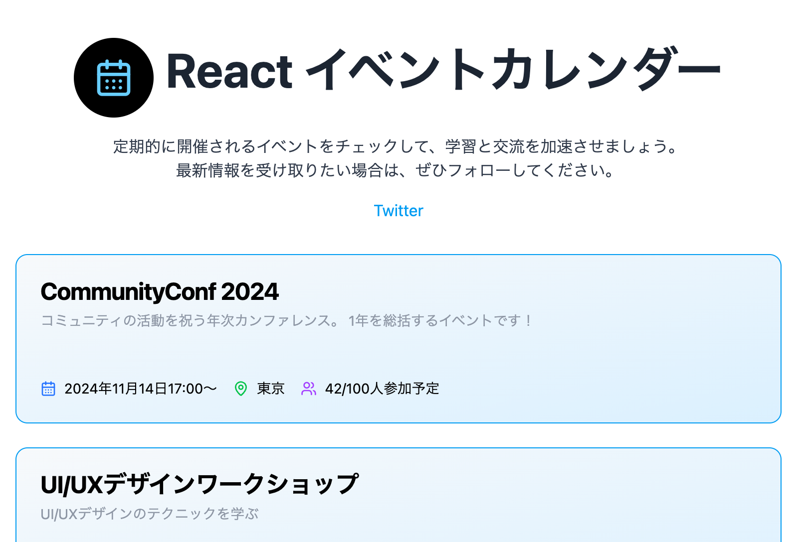
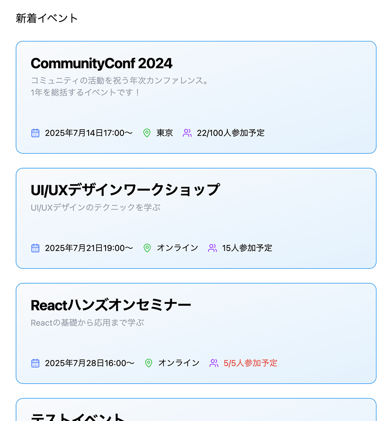
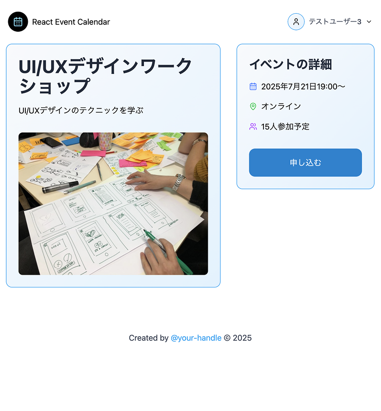
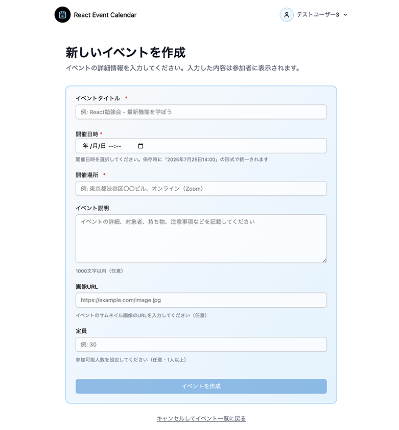

# React Road お題チャレンジ　- イベント掲載アプリ -

connpass のようなイベントの掲載・申し込みができるアプリ 
React Router によるクライアントサイドルーティングを実践し、SPA の実装を学ぶ。 

React の実践型学習プラットフォーム [React Road](https://react-road.b13o.com/) のお題 [イベント掲載アプリ](https://react-road.b13o.com/challenges/event-listing-app)に挑戦させていただいた学習プロジェクトです。 
 
課題の実装の他、個人的な学習目的で私が行った変更や追加機能が含まれています。 

> [!NOTE]
> このリポジトリは、個人的な学習およびデモンストレーションの目的のみに使用されます。 
> This repository is for personal learning and demonstration purposes only.

## 🌐 デモサイト・スクリーンショット

[View Demo site](https://demo-react-event-calendar.pages.dev/)
 

<!-- デスクトップ表示用テーブル（2行2列） -->
<table style="border-collapse: collapse; width: 100%;">
  <colgroup>
    <col style="width: 50%;">
    <col style="width: 50%;">
  </colgroup>
  <tr>
    <td width="50%" align="center" style="padding: 8px;">
      <a href="https://demo-react-event-calendar.pages.dev/" target="_blank">
        <picture>
          <source srcset="./public/screenshot.webp" type="image/webp" />
          
        </picture>
      </a>
      
<em>トップページ</em>

    </td>
    <td width="50%" align="center" style="padding: 8px;">
      <a href="https://demo-react-event-calendar.pages.dev/" target="_blank">
        <picture>
          <source srcset="./public/screenshot-2.webp" type="image/webp" />
          
        </picture>
      </a>
      
<em>イベント一覧ページ</em>

    </td>
  </tr>
  <tr>
    <td width="50%" align="center" style="padding: 8px;">
      <a href="https://demo-react-event-calendar.pages.dev/" target="_blank">
        <picture>
          <source srcset="./public/screenshot-3.webp" type="image/webp" />
          
        </picture>
      </a>
      
<em>イベント詳細ページ</em>

    </td>
    <td width="50%" align="center" style="padding: 8px;">
      <a href="https://demo-react-event-calendar.pages.dev/" target="_blank">
        <picture>
          <source srcset="./public/screenshot-4.webp" type="image/webp" />
          
        </picture>
      </a>
      
<em>イベント作成フォーム</em>

    </td>
  </tr>
</table>

## ✨ 主な機能

### 🏁 基本機能（React Road お題）

1. **イベント一覧ページ**： サイトアクセス時に、イベント一覧を表示
2. **イベント詳細ページ**： イベント詳細情報を表示
3. **イベント申し込みページ**： イベントに申し込むためのメールフォーム
4. **申し込み完了ページ**： 申し込み完了メッセージを表示

### 🚀 追加実装済み機能

- [x] **認証システム** - ユーザー登録・ログイン・ログアウト機能 [#3](https://github.com/oumelab/demo-react-event-calendar/issues/3)
- [x] **イベント管理** - CRUD操作でイベントの作成・編集・削除 [#4](https://github.com/oumelab/demo-react-event-calendar/issues/4), [#17](https://github.com/oumelab/demo-react-event-calendar/issues/17)
- [x] **データベース連携** - イベントと参加者情報をデータベースに保存 [#1](https://github.com/oumelab/demo-react-event-calendar/issues/1)
- [x] **定員管理** - 参加者が満員の場合、参加できないよう制御
- [x] **型安全性** - フロントエンドとバックエンドで型定義を共有
- [x] **モダンフォーム** - React Hook Form + Zod [#16](https://github.com/oumelab/demo-react-event-calendar/issues/16)
- [x] **状態管理** - Zustand による効率的な状態管理 [#29](https://github.com/oumelab/demo-react-event-calendar/issues/29)
- [x] **ルーティング** - React Router v6 → v7 へのアップデート

### 🔮 実装予定機能

- [ ] **イベント申し込み機能** - 実際の申し込み処理とメール通知 [#5](https://github.com/oumelab/demo-react-event-calendar/issues/5)
- [ ] **申し込みキャンセル** - 参加キャンセル機能 [#28](https://github.com/oumelab/demo-react-event-calendar/issues/28)
- [ ] **画像アップロード** - イベント画像のアップロード機能 [#19](https://github.com/oumelab/demo-react-event-calendar/issues/19)

## 🛠️使用技術

| カテゴリ               | 技術スタック                                         |
| ---------------------- | ---------------------------------------------------- |
| **フロントエンド**     | Vite, React, React Router v7, TailwindCSS, shadcn/ui |
| **状態管理・フォーム** | TanStack Query, Zustand, React Hook Form             |
| **バリデーション**     | Zod（フロントエンド・バックエンド共通スキーマ）      |
| **バックエンド**       | Cloudflare Pages Functions                           |
| **データベース**       | Turso（libSQL）                                      |
| **認証**               | Better Auth                                          |
| **デプロイ**           | Cloudflare Pages                                     |
| **開発ツール**         | TypeScript, bun                                      |

