# React Road お題チャレンジ　- イベント掲載アプリ -

connpass のようなイベントの掲載・申し込みができるアプリ<br />
React Router によるクライアントサイドルーティングを実践し、SPA の実装を学ぶ。<br />

React の実践型学習プラットフォーム [React Road](https://react-road.b13o.com/) のお題 [イベント掲載アプリ](https://react-road.b13o.com/challenges/event-listing-app)に挑戦させていただいた学習プロジェクトです。<br />
<br />
課題の実装の他、個人的な学習目的で私が行った変更や追加機能が含まれています。<br />

> [!NOTE]
> このリポジトリは、個人的な学習およびデモンストレーションの目的のみに使用されます。<br />
> This repository is for personal learning and demonstration purposes only.

## 🌐 デモサイト・スクリーンショット

[👀 View Demo site](https://demo-react-event-calendar.pages.dev/)
<br />
<p>匿名ログイン（アカウント登録不要）で気軽に申し込み・キャンセル機能を試用可能です。</p>
<br />

<!-- デスクトップ表示用テーブル（2行2列） -->
<table style="border-collapse: collapse; width: 100%;">
  <colgroup>
    <col style="width: 50%;">
    <col style="width: 50%;">
  </colgroup>
  <tr>
    <td width="50%" align="center" style="padding: 8px;">
    <a href="./public/docs/screenshot/screenshot.png" target="_blank">
        <picture>
          <source srcset="./public/docs/screenshot/screenshot.webp" type="image/webp" />
          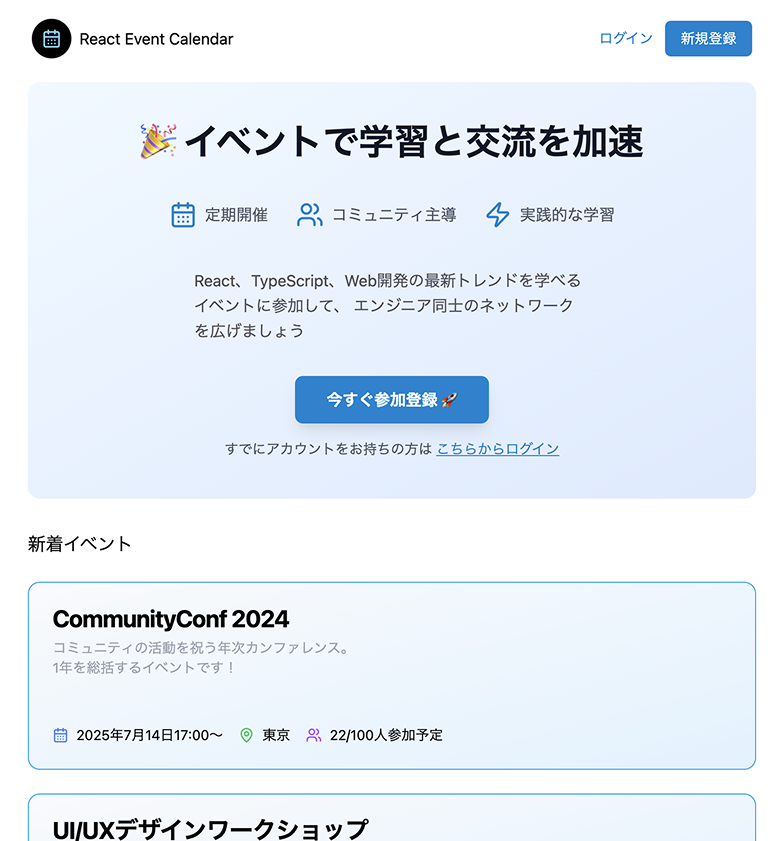
        </picture>
        </a>
      <p><em>トップページ</em></p>
    </td>
    <td width="50%" align="center" style="padding: 8px;">
    <a href="./public/docs/screenshot/screenshot-2.png" target="_blank">
        <picture>
          <source srcset="./public/docs/screenshot/screenshot-2.webp" type="image/webp" />
          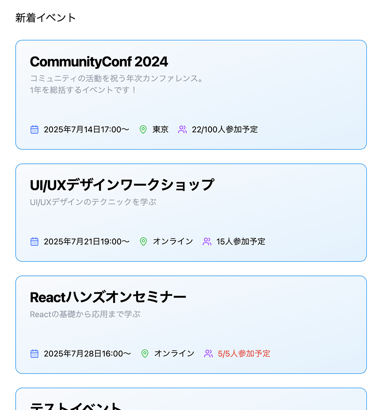
        </picture>
        </a>
      <p><em>イベント一覧ページ</em></p>
    </td>
  </tr>
  <tr>
    <td width="50%" align="center" style="padding: 8px;">
    <a href="./public/docs/screenshot/screenshot-3.png" target="_blank">
        <picture>
          <source srcset="./public/docs/screenshot/screenshot-3.webp" type="image/webp" />
          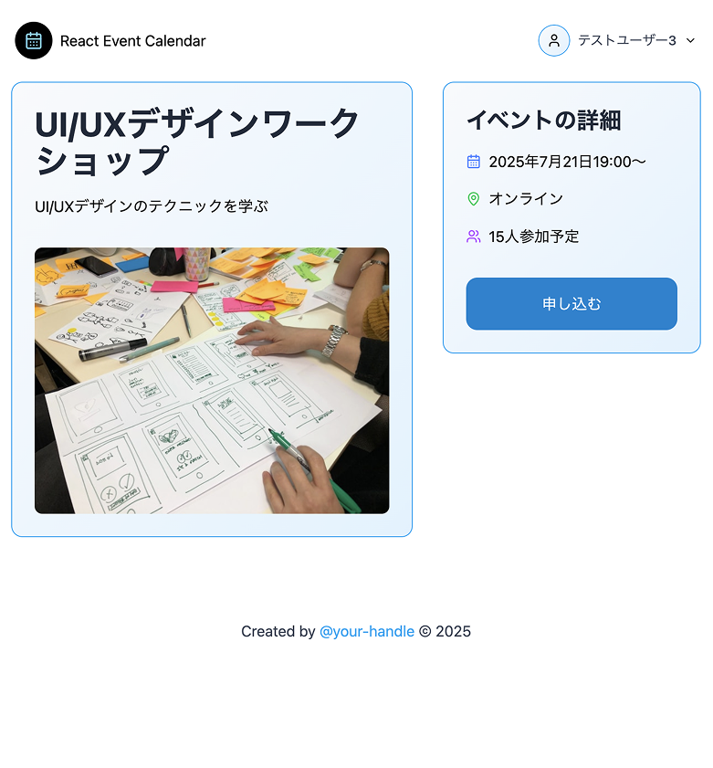
        </picture>
        </a>
      <p><em>イベント詳細ページ</em></p>
    </td>
    <td width="50%" align="center" style="padding: 8px;">
    <a href="./public/docs/screenshot/screenshot-4.png" target="_blank">
        <picture>
          <source srcset="./public/docs/screenshot/screenshot-4.webp" type="image/webp" />
          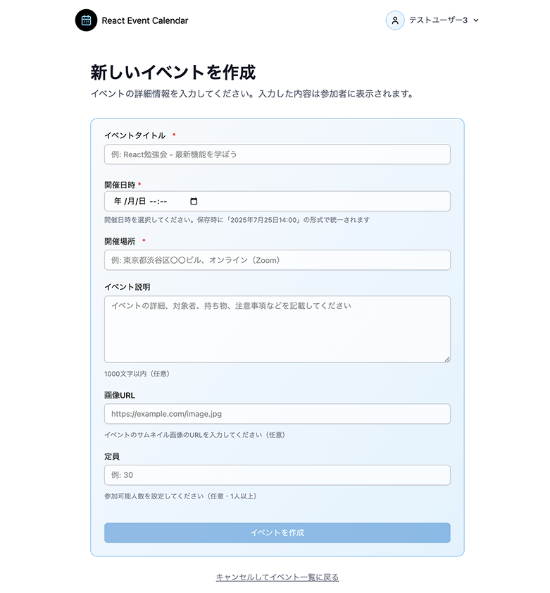
        </picture>
        </a>
      <p><em>イベント作成フォーム</em></p>
    </td>
  </tr>
  <tr>
    <td width="50%" align="center" style="padding: 8px;">
    <a href="./public/docs/screenshot/screenshot-7.png" target="_blank">
        <picture>
          <source srcset="./public/docs/screenshot/screenshot-7.webp" type="image/webp" />
          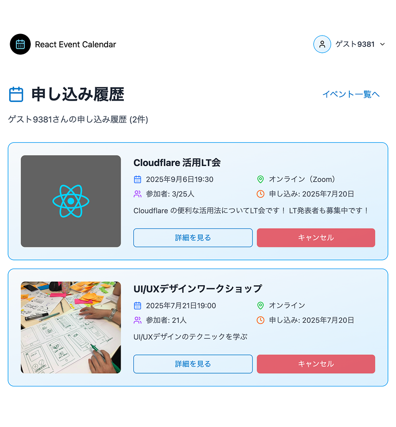
        </picture>
        </a>
      <p><em>イベント申し込み履歴ページ</em></p>
    </td>
    <td width="50%" align="center" style="padding: 8px;">
    <a href="./public/docs/screenshot/screenshot-8.png" target="_blank">
        <picture>
          <source srcset="./public/docs/screenshot/screenshot-8.webp" type="image/webp" />
          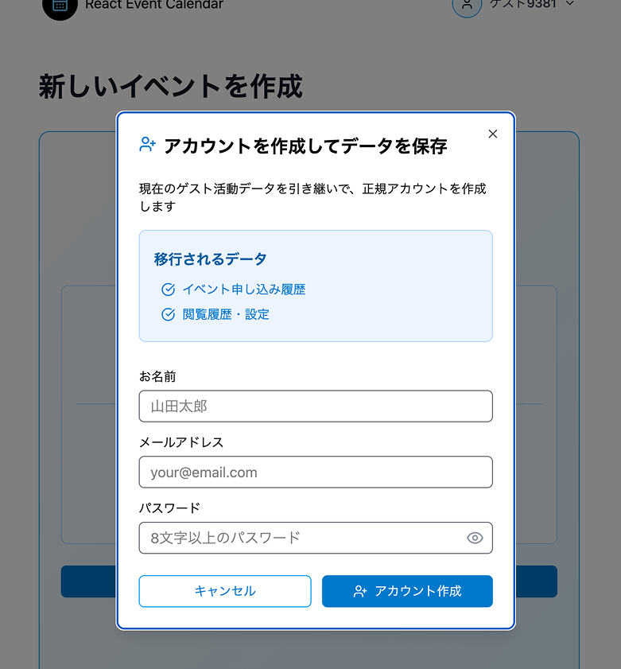
        </picture>
        </a>
      <p><em>Anonymous→本アカウント登録ダイアログ</em></p>
    </td>
  </tr>
</table>

## ✨ 主な機能

### 基本機能（React Road お題）

1. **イベント一覧ページ**： サイトアクセス時に、イベント一覧を表示
2. **イベント詳細ページ**： イベント詳細情報を表示
3. **イベント申し込みページ**： イベントに申し込むためのメールフォーム(フロントエンドのみ)
4. **申し込み完了ページ**： 申し込み完了メッセージを表示

### 追加実装済み機能

- [x] **認証システム** - ユーザー登録・ログイン・ログアウト機能 [#3](https://github.com/oumelab/demo-react-event-calendar/issues/3)
- [x] **イベント管理** - CRUD 操作でイベントの作成・編集・削除 [#4](https://github.com/oumelab/demo-react-event-calendar/issues/4), [#17](https://github.com/oumelab/demo-react-event-calendar/issues/17)
- [x] **データベース連携** - イベントと参加者情報をデータベースに保存 [#1](https://github.com/oumelab/demo-react-event-calendar/issues/1)
- [x] **定員管理** - 参加者が満員の場合、参加できないよう制御
- [x] **型安全性** - フロントエンドとバックエンドで型定義を共有
- [x] **モダンフォーム** - React Hook Form + Zod [#16](https://github.com/oumelab/demo-react-event-calendar/issues/16)
- [x] **状態管理** - Zustand による効率的な状態管理 [#29](https://github.com/oumelab/demo-react-event-calendar/issues/29)
- [x] **ルーティング** - React Router v6 → v7 へのアップデート
- [x] **イベント申し込み・キャンセル機能** - 参加申し込みとキャンセル機能 [#5](https://github.com/oumelab/demo-react-event-calendar/issues/5)
- [x] **Anonymous 認証** - 登録なしでゲストとしてイベント申し込みが可能、本アカウントへデータ移行も可能 [#43](https://github.com/oumelab/demo-react-event-calendar/issues/43)
- [x] **バンドルサイズ分析・最適化** - `rollup -plugin-visualizer`導入、チャンク分割・動的インポートによるバンドルサイズ削減・最適化 [#45](https://github.com/oumelab/demo-react-event-calendar/issues/45)

### 実装予定機能

- [ ] **イベント作成履歴** - イベント作成履歴の表示 [#40](https://github.com/oumelab/demo-react-event-calendar/issues/40)
- [ ] **画像アップロード** - イベント画像のアップロード機能 [#19](https://github.com/oumelab/demo-react-event-calendar/issues/19)
- [ ] **ユーザー情報編集機能** - ユーザープロフィールページ・ユーザー情報の編集機能実装 [#18](https://github.com/oumelab/demo-react-event-calendar/issues/18)
- [ ] **イベント終了日時** - イベントの終了日時を設定 [#42](https://github.com/oumelab/demo-react-event-calendar/issues/42)
- [ ] **Google カレンダーに追加** - イベントを Google カレンダーに追加
- [ ] **ページネーション** - イベント一覧のページネーション
- [ ] **イベント検索機能** - イベント検索機能
- [ ] **メール通知** - メール通知システム実装 [#28](https://github.com/oumelab/demo-react-event-calendar/issues/28)

## 🛠️ 使用技術

| カテゴリ               | 技術スタック                                         |
| ---------------------- | ---------------------------------------------------- |
| **フロントエンド**     | Vite, React, React Router v7, TailwindCSS, shadcn/ui |
| **状態管理・フォーム** | TanStack Query, Zustand, React Hook Form             |
| **バリデーション**     | Zod（フロントエンド・バックエンド共通スキーマ）      |
| **バックエンド**       | Cloudflare Pages Functions                           |
| **データベース**       | Turso（libSQL）                                      |
| **認証**               | Better Auth                                          |
| **デプロイ**           | Cloudflare Pages                                     |
| **開発ツール**         | TypeScript, Bun, rollup-plugin-visualizer            |

## 📊 プロジェクト構成図

### 🏗️ システムアーキテクチャ

<a href="./public/docs/system-architecture.png" target="_blank">
  <picture>
    <source srcset="./public/docs/system-architecture.webp" type="image/webp" />
      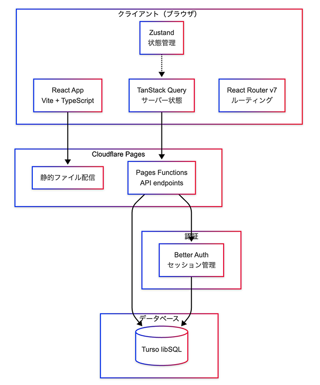
  </picture>
</a>

<details>
  <summary>Mermaid</summary>

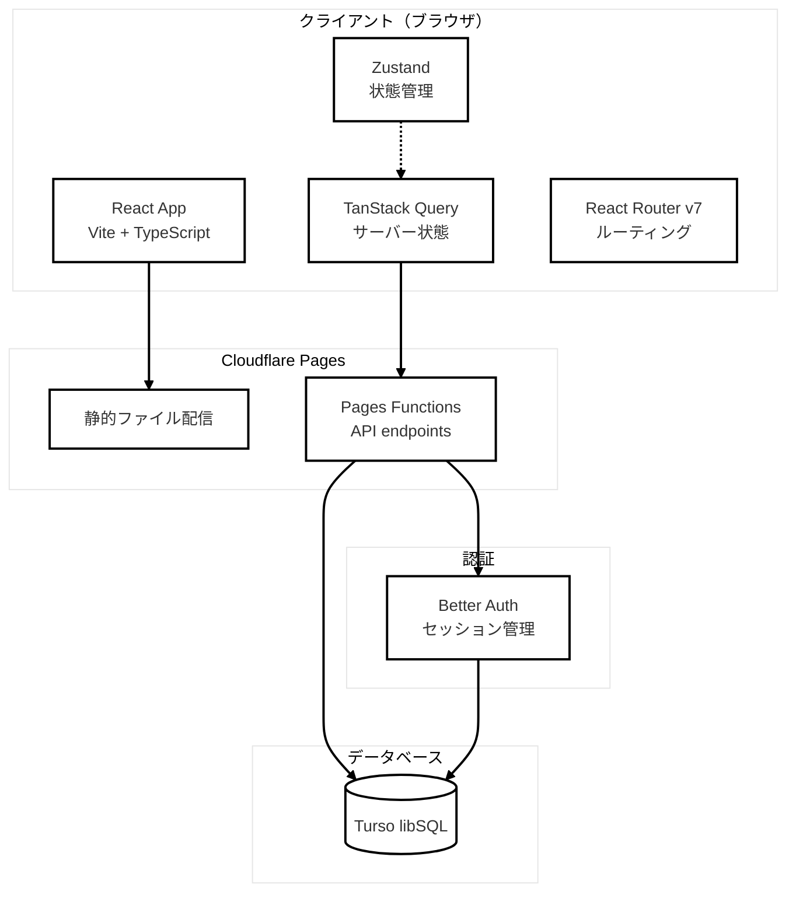

</details>

### 🗄️ データベース構成（ER 図）

<a href="./public/docs/database-configuration.png" target="_blank">
  <picture>
    <source srcset="./public/docs/database-configuration.webp" type="image/webp" />
    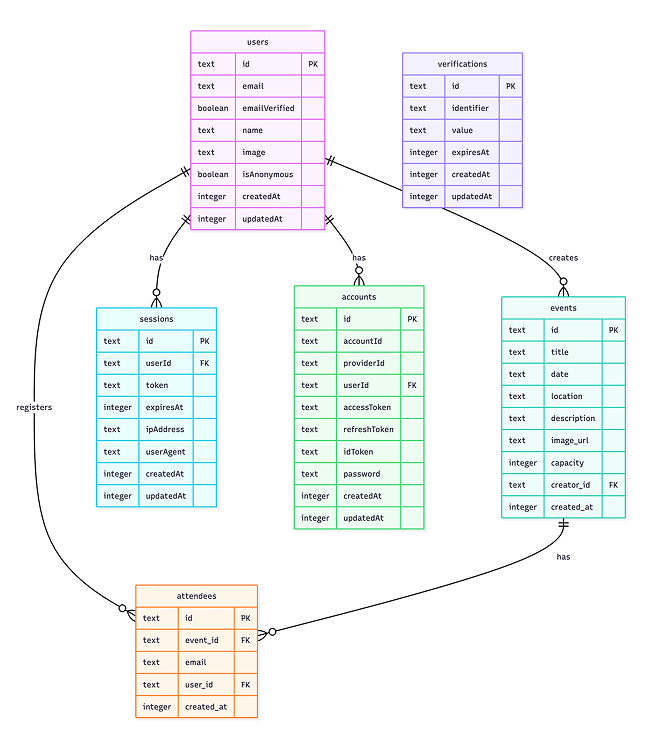
  </picture>
</a>

<details>
  <summary>Mermaid</summary>

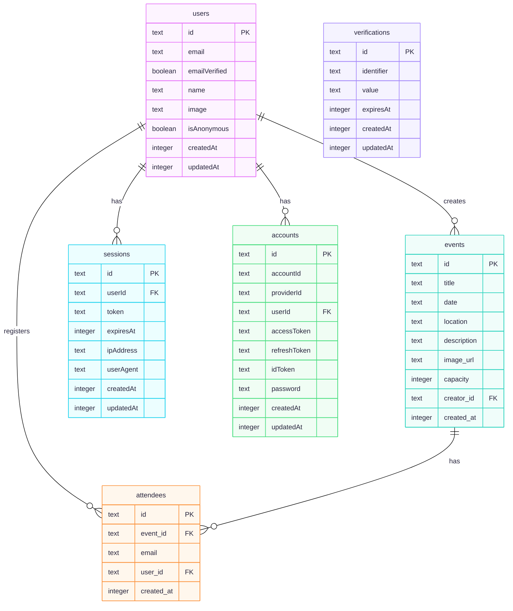

</details>

### 🔄 状態管理フロー

<a href="./public/docs/state-management-flow.png" target="_blank">
  <picture>
    <source srcset="./public/docs/state-management-flow.webp" type="image/webp" />
    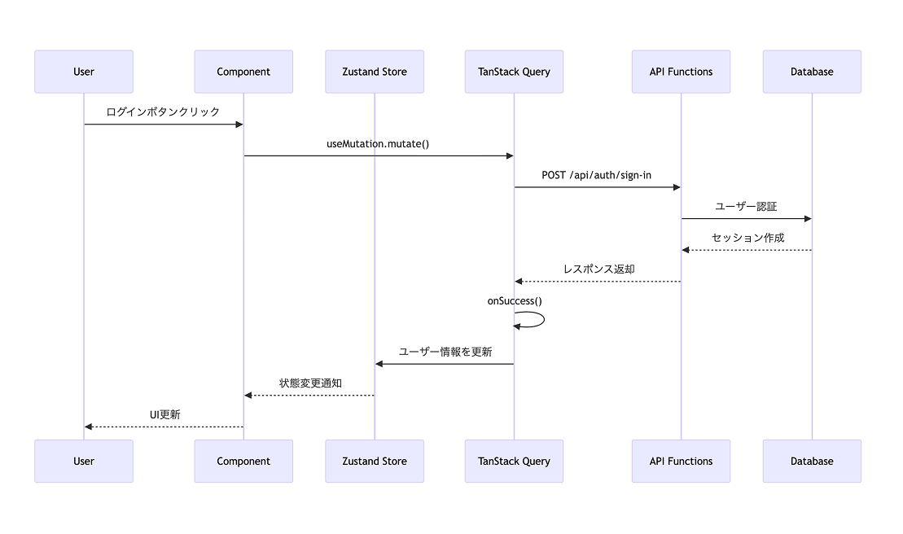
  </picture>
</a>

<details>
  <summary>Mermaid</summary>

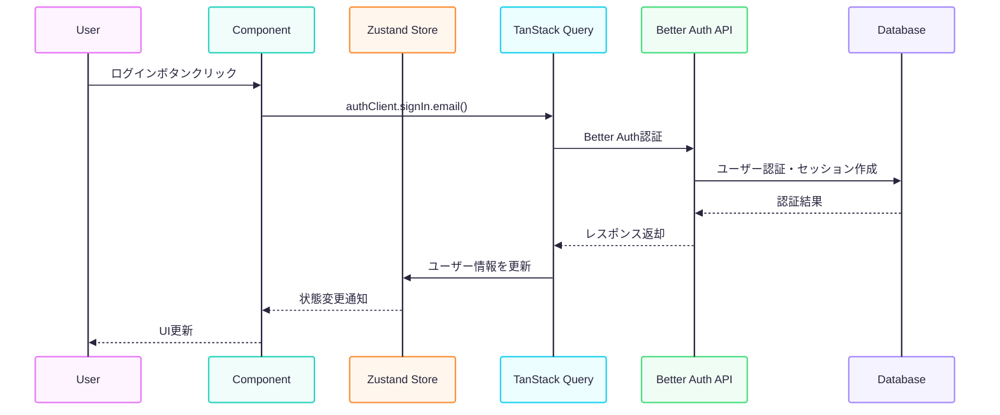

</details>

### 🌐 API エンドポイント構成

### **🗓️ イベント管理**

| エンドポイント            | メソッド | 認証 | 説明             |
| ------------------------- | -------- | ---- | ---------------- |
| `/api/events`             | GET      | -    | イベント一覧取得 |
| `/api/events/[id]`        | GET      | -    | イベント詳細取得 |
| `/api/events/create`      | POST     | ✅   | イベント作成     |
| `/api/events/[id]/update` | PUT      | ✅   | イベント更新     |
| `/api/events/[id]/delete` | DELETE   | ✅   | イベント削除     |

### **📝 イベント参加**

| エンドポイント            | メソッド | 認証 | 説明                       |
| ------------------------- | -------- | ---- | -------------------------- |
| `/api/events/[id]/apply`  | POST     | ✅   | イベント申し込み           |
| `/api/events/[id]/cancel` | DELETE   | ✅   | イベント申し込みキャンセル |
| `/api/user/registrations` | GET      | ✅   | ユーザー申し込み履歴取得   |

### **🔐 認証システム**

Better Auth による統一認証エンドポイント
| エンドポイント | メソッド | 認証 | 説明 |
| ------------------- | -------- | ---- | ------------------ |
| `/api/auth/sign-in` | POST | - | ユーザーログイン |
| `/api/auth/sign-up` | POST | - | ユーザー新規登録 |
| `/api/auth/sign-out`| POST | ✅ | ユーザーログアウト |
| `/api/auth/session` | GET | - | セッション情報取得 |

> Note: Better Auth の [[catchall]] ハンドラーにより、認証関連のエンドポイントは自動的に提供される。

## 🚀 Anonymous 認証の特徴

### ゲストユーザー体験

- 登録なしで即体験: 面倒な会員登録なしでイベントの閲覧・申し込みが可能
- 一時的なデータ保存: 申し込み履歴は匿名ユーザー ID で一時保存
- スムーズなアップグレード: ワンクリックで正規ユーザーに移行

### データ移行システム

<a href="./public/docs/anonymous-login-flow.png" target="_blank">
  <picture>
    <source srcset="./public/docs/anonymous-login-flow.webp" type="image/webp" />
    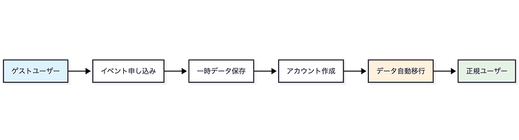
  </picture>
</a>

<details>
  <summary>Mermaid</summary>

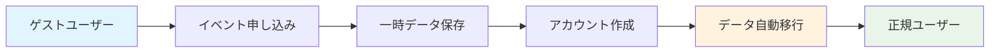

</details>

### 移行されるデータ

- ✅ イベント申し込み履歴
- ✅ ユーザー設定・preferences
- ✅ セッション情報

## 🔧 開発環境

### 必要なツール

- Node.js: 22.16.0 (.nvmrc で指定)
- パッケージマネージャー: bun
- TypeScript: ^5.7.2

### 開発サーバー起動

```bash
# フロントエンド (Vite)
bun run dev

# バックエンド (Wrangler + Vite)
bunx wrangler pages dev -- bun run dev
```

### ビルド・プレビュー

```bash
# ビルド
bun run build

# プレビュー
bun run preview
```

## 📊 パフォーマンス最適化

### バンドル分析・最適化

- **rollup-plugin-visualizer** によるバンドルサイズ分析
- **チャンク分割**: React、Router、Form ライブラリを個別バンドル化
- **遅延読み込み**: React.lazy() によるイベント作成画面の動的インポート
- **成果**: 初期バンドルサイズ 29%削減（647KB → 460KB）

```bash
# バンドル分析実行
bun run build:analyze
```
